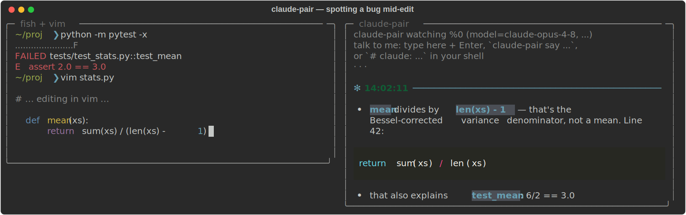
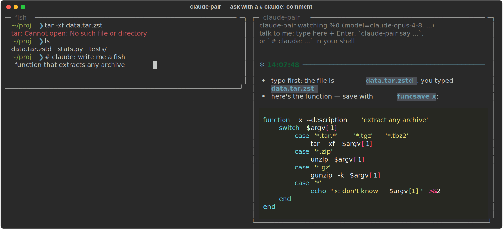

# claude-pair

A Claude pair programmer that looks over your shoulder in tmux. It watches the
pane you're working in — commands, output, even half-typed un-executed command
lines — and streams suggestions into a side pane when (and only when) it has
something worth saying. With the vim plugin installed it also sees the code
around your cursor, including unsaved edits.



Ask it something directly with a `# claude:` comment at your prompt (a fish
no-op), and pull the answer's code straight into vim with `<leader>cl`:



(Screenshots are generated from the real rendering code by
`docs/make_screenshots.py`.)

## How it works

- Follows your **active pane**: whatever pane you're working in (across
  windows too) is what it watches, re-resolved every poll. Its own side pane
  is excluded, so clicking in to type it a message doesn't confuse it.
  `--pin` locks it to the launch pane instead.
- When you're on a **different window** than the watcher pane, a real
  suggestion pings the tmux status line (`✻ claude-pair: … (:cl / claude-pair
  last)`) so you know to pull it up — no ping when the side pane is already
  in view. `--no-notify` turns it off.
- Polls `tmux capture-pane` about once a second (visible screen + a little
  scrollback, so it sees the command line as you type it).
- When the pane content changes and then goes quiet for ~1.5s (debounced),
  it sends a snapshot to Claude, with a rolling conversation history so it
  remembers what it already told you.
- Claude is instructed to reply `SKIP` unless it spots something genuinely
  useful — a typo in the command you're about to run, a fix for the error
  that just scrolled by, a dangerous command, a bug in the code on screen.
  SKIPs render as a quiet `·`; real suggestions stream in under a timestamp.
- Prompt caching keeps the repeated context cheap; only new snapshot content
  is billed at full input price.
- Output is rendered with [rich](https://github.com/Textualize/rich):
  suggestions are light markdown, so bullets render as bullets and fenced
  code blocks (```python, ```fish, …) are syntax-highlighted as they stream
  in. `--theme` picks the pygments theme (default `monokai`).

## Install

```sh
pip install -e .           # from this repo; installs the `claude-pair` command
```

Authentication: set `ANTHROPIC_API_KEY`, or log in once with
[`ant auth login`](https://platform.claude.com/docs/en/api/sdks/cli) — the SDK
picks up the profile automatically.

```fish
set -Ux ANTHROPIC_API_KEY sk-ant-...
```

To update later:

```sh
claude-pair update
```

That pulls this repo, reinstalls if anything changed, and runs
`vim +PlugUpdate` to refresh vim-plug's copy of the plugin (a no-op if you
don't use vim-plug).

### Vim plugin

Copy or symlink `vim/plugin/claude_pair.vim` into your plugin directory, or
point your plugin manager at this repo:

```vim
" vim-plug
Plug 'you/tmux-claude-continuous', {'rtp': 'vim'}
```

The plugin writes cursor/file/buffer state to
`~/.cache/claude-pair/vim_state.json` on `CursorHold`, `InsertLeave`,
`BufEnter`, and `BufWritePost`. It makes no network calls. For fresher state
while you pause mid-edit, lower `updatetime`:

```vim
set updatetime=1000
let g:claude_pair_context_lines = 60   " lines of buffer context (default 60)
```

`:ClaudePairToggle` turns state-writing off/on.

## Use

Inside tmux, in the pane you want watched:

```sh
claude-pair
```

That splits a 60-column side pane (focus stays where you are) and starts
watching. Ctrl-C in the side pane (or just kill the pane) stops it.

### Talking to it

Three ways to ask it something directly (direct messages are always answered
— no `SKIP` — and skip the debounce/cooldown):

- **Type in the watcher pane.** Jump into the side pane, type a message, hit
  Enter.
- **`claude-pair say "why did that fail?"`** from any pane or script. Messages
  land within a second.
- **A shell comment in your work pane.** Type `# claude: how do I undo the
  last commit?` at the prompt — in fish that's a no-op comment, but the
  watcher sees it on screen and answers it once.

### Loading extra context

Give Claude reference material to consult — the file you're working in, or a
few source files it should understand — beyond what's on screen. Loaded
context is a *content snapshot* (captured when you load it) and rides along
as a **prompt-cached prefix**, so after the first call it's billed at ~10% —
cheap to keep loaded.

- **At launch:** `claude-pair --context stats.py --context jax/_src/numpy/`
  (repeatable; files or directories). Replaces any previously-loaded
  context.
- **While running, from any pane:**
  ```fish
  claude-pair context add path/to/file.py   # or a directory
  claude-pair context list
  claude-pair context clear
  ```
  The watcher picks up changes within a second (`→ context updated`).
- **From vim:** `:ClaudeContext` (`<leader>cc`) sends the **whole current
  file** — the full buffer, not just the cursor region the plugin streams by
  default. Re-run it to refresh after big edits.

Directories are walked with the usual noise skipped (`.git`,
`__pycache__`, `node_modules`, binaries, …) up to `--context-budget` chars
per path (default 120k ≈ 30k tokens); anything over budget is **skipped with
a note**, never silently dropped.

**On whole codebases:** a large library like jax (1M+ tokens) won't fit in
context, so point `--context` at the *specific* files or subdirectory you're
touching, not the whole tree — the budget guard protects you either way. And
Claude already knows popular libraries like jax well from training, so you
often only need to load *your* code, not theirs.

### Recalling the last suggestion

Every real suggestion (not the `SKIP`s) is saved under `~/.cache/claude-pair/`:
the full text in `last_suggestion.txt`, just the fenced code blocks in
`last_code.txt`, and a running history in `suggestions.log`. The model is
told fences are the deliverable — paste-ready code, prose stays outside — so
"the code part" is well defined.

- **In vim:** `:ClaudeLast` (`<leader>cl`) pastes the code from the latest
  suggestion at your cursor and reports how many lines it inserted. Undo with
  a single `u` as usual. `:ClaudeLastShow` (`<leader>cs`) opens the *full*
  suggestion — prose included — in a small markdown scratch split with
  syntax-highlighted code blocks (`q` closes it;
  `g:markdown_fenced_languages` defaults to `python, fish, sh, vim`). Set
  `let g:claude_pair_default_mappings = 0` to opt out of both mappings, or
  map `<Plug>(ClaudePairLast)` / `<Plug>(ClaudePairShow)` yourself.
- **In fish (or any shell):** `claude-pair last` renders the full suggestion
  (colors on a tty, plain when piped); `claude-pair last --code` prints just
  the raw code — handy as `claude-pair last --code | fish_clipboard_copy`.
  A `claude-last` wrapper function ships in `fish/functions/` — copy or
  symlink it into `~/.config/fish/functions/` if you want the shorter name.

Useful flags (pass them to `claude-pair`; they're forwarded to the watcher):

| flag | default | meaning |
|---|---|---|
| `--pin` | off | watch only the launch/`--target` pane instead of following the active one |
| `--no-notify` | on | disable the tmux status-line ping when you're on another window |
| `--context PATH` | — | file/dir to load as reference context (repeatable) |
| `--context-budget` | `120000` | max chars loaded per context path |
| `--model` | `claude-opus-4-8` | any Claude model id (`CLAUDE_PAIR_MODEL` env var also works) |
| `--effort` | `low` | reasoning effort per suggestion; raise for deeper reviews |
| `--theme` | `monokai` | pygments theme for code blocks (`dracula`, `ansi_dark`, …) |
| `--debounce` | `0.25` | seconds of quiet after a change before asking Claude |
| `--cooldown` | `2` | minimum seconds between API calls |
| `--scrollback` | `50` | extra history lines beyond the visible screen |
| `--history` | `8` | snapshot/reply pairs Claude remembers |
| `--width` | `60` | side pane width |
| `--dry-run` | | print the snapshots instead of calling the API |

A tmux binding makes it one keystroke:

```tmux
# ~/.tmux.conf — prefix + P starts the pair programmer for the current pane
bind P run-shell "tmux send-keys 'claude-pair' Enter"
```

## Tips

- **Terminal question → code in your buffer.** Type
  `# claude: write a fish function that ...` at your prompt, wait for the
  suggestion, then hit `<leader>cl` in vim. Question asked in the terminal,
  answer landed at your cursor.
- **Clipboard:** `claude-pair last --code | fish_clipboard_copy`.
- **Fresher vim context:** `set updatetime=1000` so the plugin writes state
  after 1s pauses instead of the default 4s.
- **Pane focus:** the side pane never steals focus; SKIPs show as a dim `·`
  so you can see it's alive without reading it.
- **Tune the chattiness** in `SYSTEM_PROMPT` (`claude_pair/watcher.py`) —
  the "worth interrupting for" list is the dial.

## Cost note

Default settings call the API on every pause in activity, with Opus. With
`--debounce 0.25` and `--cooldown 2` that's up to ~30 calls/minute while
you're actively working — the cooldown is the effective rate limiter. Prompt
caching keeps repeated context ~10x cheaper, but if you leave it running all
day and want it cheaper still, drop the model
(`--model claude-sonnet-5` or `claude-haiku-4-5`) or raise
`--debounce`/`--cooldown`.

## Troubleshooting

- **`run this inside a tmux session`** — the launcher needs `$TMUX`; start
  tmux first.
- **No vim context in suggestions** — check that
  `~/.cache/claude-pair/vim_state.json` updates while you edit (the watcher
  ignores it after 2 minutes of staleness), and that the plugin loaded
  (`:echo g:loaded_claude_pair`).
- **Too chatty / too quiet** — chattiness lives in the system prompt in
  `claude_pair/watcher.py` (`SYSTEM_PROMPT`); tune the "worth interrupting
  for" list to taste.
